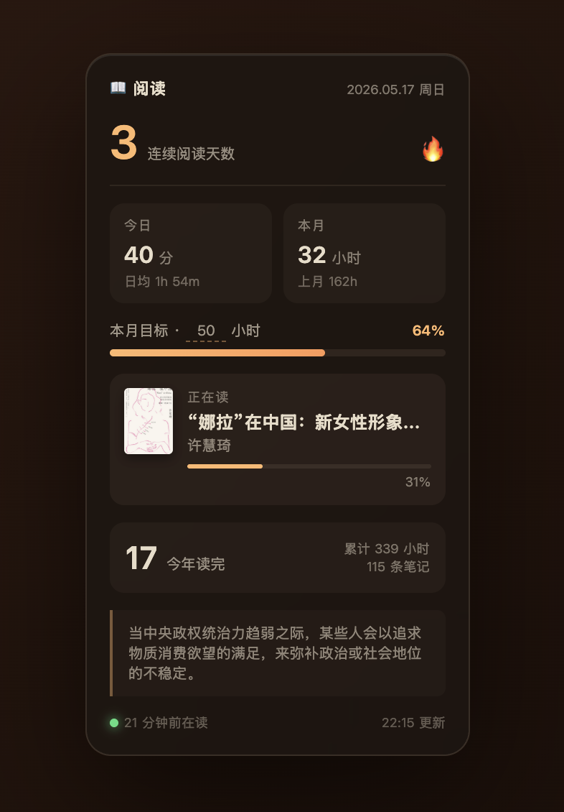

# Reading Widget · 微信读书桌面小卡片



一个挂在 macOS 桌面壁纸层的小组件，显示你的微信读书数据：连续阅读天数、今日/本月阅读时长、本月目标进度、正在读的书 + 进度、今年读完本数、当下金句。每 5 分钟自动刷新。

> 本项目是微信读书官方 [`weread-skills`](https://cdn.weread.qq.com/skills/weread-skills.zip) 之上的一层**渲染壳**，数据全部来自微信读书官方 Agent API。详见下方[致谢](#致谢-acknowledgments)。


## 怎么装

### 给 Claude Code 用户（最简单）

```
~/.claude/skills/reading-widget/
```
下解压本仓库（或 `git clone` 后改名），然后跟 Claude 说「装一下 reading-widget」，它会按 `SKILL.md` 走完整流程。

### 手动安装

前置：
- macOS
- Python 3（系统自带）
- [Übersicht](http://tracesof.net/uebersicht/) — `brew install --cask ubersicht`
- 一个微信读书 Agent API key（格式 `wrk-xxxxxxxx`，下方有说明）

```bash
git clone https://github.com/YOURNAME/reading-widget.git
cd reading-widget
chmod +x install.sh
./install.sh
```

打开 Übersicht → 菜单栏 👁️ → Refresh All Widgets。

## 微信读书 API key 怎么拿

下载微信读书官方 skill 包，里面有 Agent Gateway 的鉴权说明：

```
https://cdn.weread.qq.com/skills/weread-skills.zip
```

解压后看 `SKILL.md` 的「鉴权」一节，按指引申请你自己的 `wrk-xxxxxxxx` key。

拿到后建议写进 `~/.claude/settings.json`：

```json
{
  "env": {
    "WEREAD_API_KEY": "wrk-xxxxxxxx"
  }
}
```

或者直接 `export WEREAD_API_KEY=wrk-xxx` 加进 shell rc。

## 自定义

- **月度目标小时**：编辑 `~/Desktop/reading-widget/config.json` 的 `goal_hours`，或者在 widget 卡片上点那个数字直接改
- **位置**：编辑 `~/Library/Application Support/Übersicht/widgets/reading.widget/index.coffee` 末尾的 `style` 块（top/left/right/bottom）
- **大小**：改 `template.html` 里 `.r-card` 的 `transform: scale(...)`
- **配色**：直接改 `template.html` 的 CSS，存盘后下次 update.py 跑时生效

## 卡片显示什么

| 模块 | 来源 |
|---|---|
| 连续阅读天数 | `/readdata/detail` 周桶往前翻 |
| 今日分钟 / 本月小时 / 上月小时 | `/readdata/detail` monthly + weekly |
| 本月目标进度 | 你设置的 `goal_hours` |
| 正在读 + 进度 % | `/shelf/sync` + `/book/getprogress` |
| 今年读完 / 累计时长 / 笔记数 | `/readdata/detail` annually |
| 金句 | `/book/bestbookmarks` 当前在读书的热门划线，按日期轮换 |

## 文件结构

```
reading-widget/
├── README.md
├── SKILL.md              # Claude Code 自动安装指引
├── install.sh            # 手动安装脚本
├── update.py             # 抓数据 + 渲染脚本
├── template.html         # 卡片模板
├── config.default.json   # 默认配置
├── open-widget.sh        # 可选：Chrome --app 模式打开
└── ubersicht/
    └── reading.widget/
        └── index.coffee  # Übersicht widget 定义
```

## 致谢 Acknowledgments

本项目**完全建立在微信读书官方 Agent skill 之上** —— 所有数据接口（阅读统计、书架、阅读进度、热门划线等）都来自微信读书官方维护的 Agent Gateway 和它附带的 [`weread-skills`](https://cdn.weread.qq.com/skills/weread-skills.zip) 包。本项目只是把这些接口的输出重新组合渲染成一个桌面 widget，**不涉及任何接口逆向、抓包或绕过鉴权**。如果没有官方开放这套 Agent 能力，这个 widget 不可能存在。

向微信读书团队致敬 🙏

## License

MIT（仅本仓库的渲染层代码；底层数据接口归微信读书所有，调用须遵守其 Agent 服务条款）
